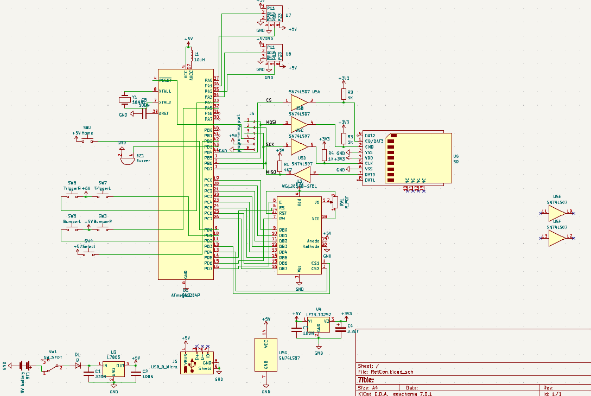
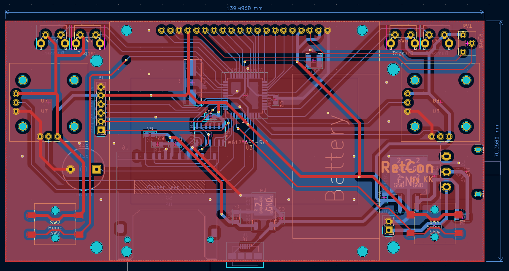
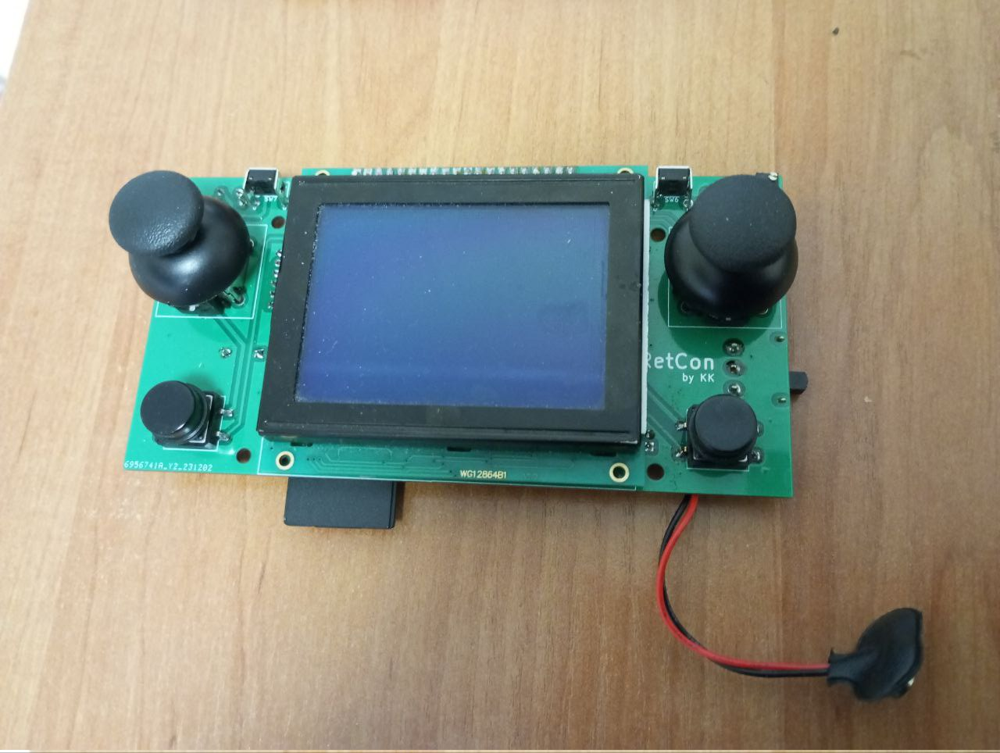

# RetCon

Mini Retro Console

Based on LLL language, works on FatFS.
Display: WG12864B1 V1.0-SFYLYHTC06
CPU: Atmega1284p

to run properly LLL( with FatFS ) you need to have at least 3K internal SRAM memory

## Dependencies
- avr-gcc
- avrdude
- cmake

## Build and Run

in program/
```
./configure.sh
./build.sh
./upload.sh
```

*if you are not using usbasp you should change upload.sh*

## Schematic

you can find schematic in `schematic_and_others/schematic` and modify it in KiCAD, or just look below:



## Board and Reality

here are some pictures how the board has been designed and how it looks in reality



